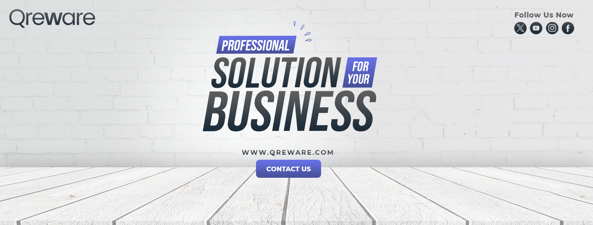

#[](https://qreware.com)

# Qreware

Welcome to **Qreware** — the future of **AI-powered development tools** and **cloud-based solutions**. We are on a mission to revolutionize the way developers, programmers, and professionals work, collaborate, and code, using cutting-edge AI technology and scalable cloud infrastructure.

## 🚀 About

**Qreware** is a platform that brings innovative software tools and solutions to professional developers, hackers, corporate individuals, gamers, and AI enthusiasts. Our mission is to streamline workflows and enhance productivity by providing **AI-powered IDEs**, **cloud services**, **FinTech solutions**, and much more. We're dedicated to making the software development experience smarter, faster, and more efficient for all.

## 🛠️ Features

- **AI-Powered IDE**: Code faster and smarter with **Claude AI Assistant** and smart autocompletion, bug detection, and error fixing.
- **Cloud-Based Compilation & Debugging**: Seamlessly compile, run, and debug your code on the cloud.
- **Real-Time Collaboration**: Work together with your team in real-time, share code, and track changes effortlessly.
- **VS Code Extension Support**: Enjoy full support for all VS Code extensions.
- **AI-Driven Code Optimization**: Automatically refactor, optimize, and generate test cases with the help of AI.
- **Secure & Scalable Cloud Infrastructure**: Build on a highly secure, scalable platform designed for professional use.

## 💻 Technology Stack

- **Frontend**: React, Electron.js, Tailwind CSS
- **Backend**: Node.js, Python (for AI integration), Express.js
- **AI Models**: Claude AI (Anthropic API), OpenAI Codex (optional)
- **Database**: PostgreSQL / Firebase (for user data & settings)
- **Cloud**: AWS, Google Cloud, or Azure for cloud services and compilation
- **Version Control**: Git, GitHub

## 🔑 Key Features in Development

- **Qreware Cloud Services**: Launch your own SaaS applications using Qreware's cloud tools.
- **AI-Driven Development Platform**: AI that adapts and learns from your coding style.
- **Full GitHub Integration**: Seamlessly link repositories, manage pull requests, and run tests within your IDE.
- **FinTech Solutions**: Implement cutting-edge financial tools and APIs with Qreware’s FinTech suite.

## 💬 Getting Started

To get started with Qreware, follow these simple steps:

1. Clone the repository:
    ```bash
    git clone https://github.com/Qreware/qreware.git
    ```

2. Install dependencies:
    ```bash
    npm install
    ```

3. Run the application:
    ```bash
    npm start
    ```

## 🤝 Contributing

We welcome contributions from the community. To contribute to **Qreware**, please follow the steps below:

1. Fork this repository.
2. Create your feature branch (`git checkout -b feature/your-feature-name`).
3. Commit your changes (`git commit -am 'Add new feature'`).
4. Push to the branch (`git push origin feature/your-feature-name`).
5. Open a Pull Request.

## 📄 License

Qreware is licensed under the MIT License. See [LICENSE](LICENSE) for more details.

## 📝 Contact

For any questions or feedback, feel free to reach out to us:

- **Email**: [support@qreware.com](mailto:support@qreware.com)
- **Twitter**: [@Qreware](https://twitter.com/Qreware)
- **LinkedIn**: [Qreware LinkedIn](https://linkedin.com/company/qreware)

---

> **Qreware** is the next step in the evolution of development tools and AI-powered solutions. Join us on our journey to make programming smarter, faster, and more efficient for everyone.
